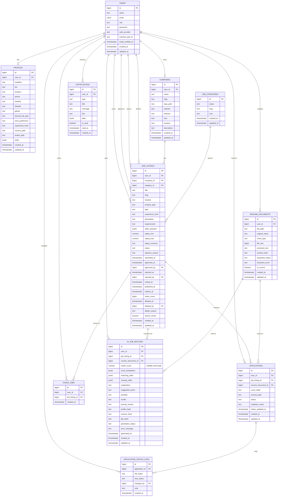

# GitHired

GitHired is a Laravel job portal for applicants, employers, and moderation-only
admins. The database has been extended to support the core job portal workflow
plus a future applicant-facing AI job matching feature.

Last reviewed: 2026-06-19

## Features

### Applicant

- Role-based account support for applicants.
- Applicant profile data: headline, bio, location, contact links, job search
  preferences, avatar, and skills.
- PDF resume document model with extracted text support for future AI matching.
- Approved job browsing data model with category, location, type, experience,
  salary, and full-text search support.
- Job applications with cover letters, resume references, unique applicant/job
  constraint, and status tracking.
- Application status history through `application_status_logs`.
- In-app notifications for application and moderation events.
- Saved jobs schema and model support.

### Employer

- Role-based account support for employers.
- Company profile model with slug, logo, website, industry, size, location, and
  description.
- Employer-owned job listings.
- Job moderation lifecycle fields for submitted, approved, rejected, closed,
  published, expired, and soft-deleted jobs.
- Applicant review data through applications, employer notes, and status
  updates.

### Admin

- Role-based account support for admins.
- Moderation-oriented job workflow:
  - approve jobs
  - reject jobs with a reason
  - close jobs
  - soft-delete or hide jobs while preserving historical applications
- Moderation audit fields: `approved_by`, `rejected_by`, `deleted_by`, and
  related timestamps.

### AI-Ready Features

- Resume text extraction storage through `resume_documents.extracted_text`.
- AI job match cache through `ai_job_matches`.
- Match score, score breakdown, matching skills, missing skills, explanation,
  suggested action, provider/model metadata, and input hashes.
- Postgres JSONB skill fields and GIN indexes for profile/job skill matching.

## Tech Stack

- PHP 8.3+
- Laravel 13
- Laravel UI
- Vite 8
- Bootstrap 5 and Bootstrap Icons
- Tailwind CSS 4 via `@tailwindcss/vite`
- Postgres/Neon-oriented schema
- SQLite-compatible migrations for local/test smoke checks where possible
- PHPUnit 12

## Setup

Install PHP, Composer, Node.js, and npm first.

```bash
composer install
npm install
cp .env.example .env
php artisan key:generate
```

For SQLite local development:

```bash
touch database/database.sqlite
php artisan migrate --seed
```

For Postgres or Neon, configure the `DB_*` values in `.env`, verify the target
branch/endpoint, then run migrations without seeding:

```bash
php artisan migrate
```

Only run `php artisan db:seed` against local databases or disposable dev/test
branches. The default seeder creates sample users, companies, jobs, and
applications, and should not be run against production or shared branches.

Use a direct Neon connection string for schema migrations. Pooled Neon
connections are better for application traffic, but migration tools may rely on
session behavior that transaction pooling does not preserve.

Run the app and Vite in separate terminals:

```bash
php artisan serve
npm run dev
```

Or run the combined development script:

```bash
composer run dev
```

Resume PDF text extraction runs through Laravel queues. Local development uses
`QUEUE_CONNECTION=sync` by default so extraction completes automatically during
upload. If you switch to `QUEUE_CONNECTION=database`, keep a queue worker
running as well:

```bash
php artisan queue:listen --tries=1 --timeout=0
```

The combined `composer run dev` script already starts that worker.

Build frontend assets:

```bash
npm run build
```

Run tests:

```bash
composer test
```

## Seeded Accounts

All seeded accounts use the password `password`.

| Role | Email |
| --- | --- |
| Admin | `admin@githired.com` |
| Employer | `marco@techph.com` |
| Applicant | `juan@email.com` |

The default route setup does not yet wire the login form to authentication, so
these accounts are mainly useful after auth routes/controllers are connected or
when signing in through a temporary local flow.

## Active Routes

The current application-facing routes are defined in `routes/web.php`. Laravel
also exposes framework routes such as `up` and local storage routes.

| Method | Path | Name | Current behavior |
| --- | --- | --- | --- |
| GET | `/` | none | Renders the landing page |
| GET | `/mockup` | none | Renders the UI mockup page |
| GET | `/jobs` | `jobs.index` | Placeholder string; duplicated route |
| GET | `/jobs/{id}` | `jobs.show` | Placeholder job detail string |
| GET | `/login` | `login` | Placeholder string |
| GET | `/register` | `register` | Placeholder string |
| GET | `/applicant/dashboard` | `applicant.dashboard` | Uses applicant dashboard controller behind `auth` |
| GET | `/applicant/applications` | `applicant.applications.index` | Placeholder string |
| GET | `/applicant/resume` | `applicant.resume` | Placeholder string |
| GET | `/applicant/profile/edit` | `applicant.profile.edit` | Placeholder string |

## Database Schema

The base Laravel/domain migrations are extended by a split schema migration set:

| Area | Concern |
| --- | --- |
| Auth and ownership | Future auth-provider fields and one-to-one owner constraints |
| Resume documents | Resume metadata and extracted text |
| Applications | Application to resume linkage |
| Job moderation | Job approval, rejection, closing, and soft-delete metadata |
| Notifications | Notification metadata and read timestamps |
| AI job matches | Cached AI job match results |
| Query support | Portable foreign-key and dashboard indexes |
| Postgres optimization | Constraints, JSONB/citext/numeric conversions, partial indexes, GIN indexes, and full-text search |

### Domain Tables

| Table | Purpose |
| --- | --- |
| `users` | Account records, roles, Laravel auth, future external auth ids |
| `profiles` | Applicant profile and skills |
| `companies` | Employer company profile |
| `job_categories` | Job category metadata |
| `job_listings` | Employer job posts, moderation lifecycle, soft deletion, search data |
| `applications` | Applicant submissions to jobs |
| `application_status_logs` | Application status history |
| `resume_documents` | Resume file metadata and extracted text |
| `saved_jobs` | Applicant saved jobs |
| `notifications` | In-app notifications |
| `ai_job_matches` | Cached AI recommendations and explanations |

### Status Values

`users.role`:

- `applicant`
- `employer`
- `admin`

`job_listings.status`:

- `draft`
- `pending`
- `active`
- `closed`
- `rejected`

`applications.status` and application status log values:

- `pending`
- `interview`
- `hired`
- `rejected`

`resume_documents.extraction_status`:

- `pending`
- `ready`
- `failed`

`ai_job_matches.generation_status`:

- `pending`
- `ready`
- `failed`

### Postgres Optimizations

- `users.email` is converted to `citext` on Postgres for case-insensitive
  email handling.
- `profiles.skills`, `job_listings.skills_required`, notification data, and AI
  match JSON fields are converted to JSONB on Postgres.
- Job salary fields are converted to `numeric(12,2)` on Postgres.
- `job_listings.search_vector` is generated for full-text job search.
- Partial indexes support active job browsing, admin pending queues, unread
  notifications, current resumes, and external auth uniqueness.
- Replacing a user's current resume must unset the old current resume and insert
  the new current resume in the same database transaction.
- GIN indexes support full-text search and JSONB skill matching.
- Foreign-key and composite indexes support dashboard and review queries.

## ERD



## Project Structure

```text
app/
  Http/Controllers/
    Applicant/DashboardController.php
    Applicant/ApplicationController.php
    Applicant/ProfileController.php
    Employer/*.php
    Admin/*.php
    AuthController.php
    JobController.php
  Models/
    AiJobMatch.php
    AppNotification.php
    Application.php
    ApplicationStatusLog.php
    Company.php
    JobCategory.php
    JobListing.php
    Profile.php
    ResumeDocument.php
    SavedJob.php
    User.php
database/
  migrations/
  seeders/DatabaseSeeder.php
resources/
  views/
routes/
  web.php
```

## Tests

The test suite currently contains Laravel's default example tests:

- `tests/Feature/ExampleTest.php` checks that `/` returns HTTP 200.
- `tests/Unit/ExampleTest.php` checks a basic truth assertion.

Current verification performed for the schema work:

- PHP syntax checks for split migrations and affected models.
- `composer test`.
- Fresh temp SQLite migration smoke test.
- Rollback of the schema extension migrations.

Broader feature tests still need to be added for auth, role authorization, job
moderation, applications, notifications, and AI match generation.

## Next Priorities

1. Wire Laravel auth routes/controllers and role redirects.
2. Add role middleware and register applicant, employer, and admin route groups.
3. Implement public job browse/detail pages using `JobListing`.
4. Implement applicant profile, PDF resume upload, application submission, and
   application tracking.
5. Implement employer company profile, job CRUD, applicant review, and status
   updates.
6. Implement admin moderation for pending, approved, rejected, closed, and
   soft-deleted jobs.
7. Implement in-app notifications.
8. Add AI job matching service after the basic portal workflows are stable.
